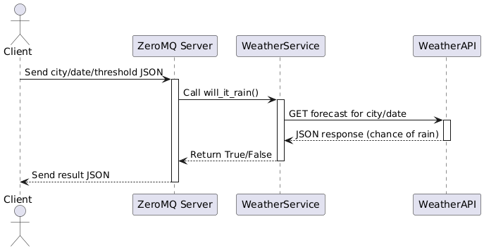

This is a microservice made for Gabriel Happ-Shine for his hiking app.

# Getting Started

1. Clone and `cd` into this repo
2. Create a virtual environment by running `python -m venv venv`
3. Activate the virtual environment by running `source venv/bin/activate`
4. Install the dependencies by running `pip install -r requirements.txt`
5. Start the microservice by running `python weather_service.py`

# Request data from microservice

The following is a sample code that a client can use to call the microservce.

```
import zmq

context = zmq.Context()
socket = context.socket(zmq.REQ)
socket.connect("tcp://localhost:5555")

request = {
    "threshold": [threshold],
    "city": [city],
    "state": [state],
    "date": [date]" # in YYYY-MM-DD format
}

socket.send_json(request)


```

# Receive data from microservice

The following code can be called to receive data returned from the microservice

```
result = socket.recv_json()
```

# UML Diagram


